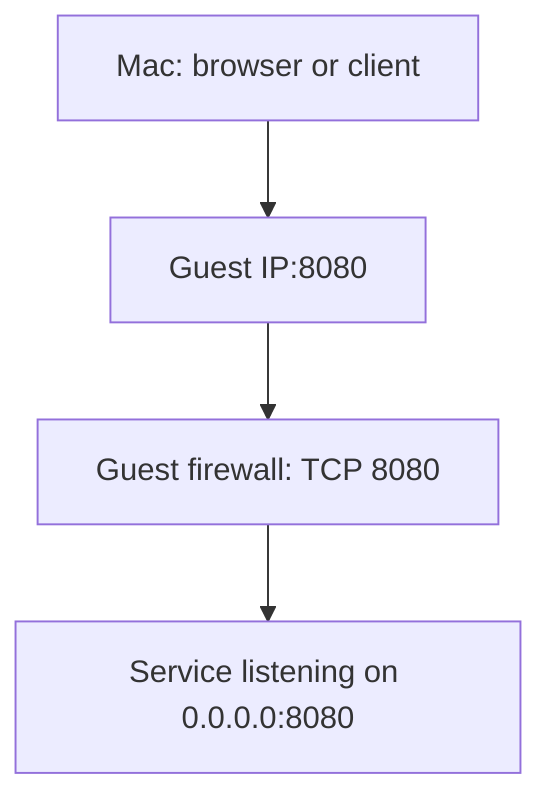

# Reach services in the VM

Limanix gives the guest its own IP address on a shared/NAT network. From your
Mac, connect to that address and the service's port.

**Three things must agree:** the service must run, it must listen on a reachable
guest interface, and the guest firewall must allow the port.



## Open a service port

For a service using TCP port `8080`, set:

```toml
[network]
mode = "shared"

[network.ports]
tcp = [8080]
udp = []
```

`shared` is the only supported `network.mode`. Port numbers must be integers
between `1` and `65535`.

Apply the change to an existing VM:

```console
limanix update --config ./limanix.toml
```

Start your application inside the guest using its own command. Configure it to
listen on `0.0.0.0:8080` or the guest's network address. An application bound only
to `127.0.0.1:8080` accepts connections from inside the guest.

On the Mac, find the guest address:

```console
limanix list
```

Read the VM's `ADDRESS` column, then open `http://<guest-ip>:8080` in your browser
if the application speaks HTTP. Replace `<guest-ip>` with the reported address.

### Ports are firewall rules

| Setting or action | What it does |
| --- | --- |
| `tcp = [8080]` | Allows inbound TCP port `8080` through the guest firewall. |
| `udp = [5353]` | Allows inbound UDP port `5353` through the guest firewall. |
| `tcp = []` or `udp = []` | Adds no openings from that configuration field. |
| Start an application | Creates the listener that can accept connections. |

The lists do not install or start services. They do not map a Mac port to a
guest port. Limanix disables Lima's automatic application port forwarding:
`localhost:8080` on the Mac is not an alias for the VM's port `8080`.

Base NixOS configuration and selected modules can add their own firewall rules.
An empty port list is therefore not a promise that every guest port is closed.

## Choose the guest architecture

Limanix chooses the VM backend from the guest architecture and the Mac's hardware:

| Mac hardware | `resources.arch` | Backend | Network |
| --- | --- | --- | --- |
| Apple Silicon | `arm64` | Apple Virtualization framework (VZ) | Native NAT |
| Intel | `amd64` | Apple Virtualization framework (VZ) | Native NAT |
| Apple Silicon | `amd64` | QEMU | Lima shared network using `socket_vmnet` |
| Intel | `arm64` | QEMU | Lima shared network using `socket_vmnet` |

Use the Limanix binary for your Mac's hardware in all four cases. Running the
Intel Limanix binary under Rosetta on Apple Silicon is rejected for VM operations.
To create an Intel guest on Apple Silicon, use the `arm64` client and select
`resources.arch = "amd64"` in the VM configuration.

The matching-architecture VZ path does not require QEMU or `socket_vmnet`.
The client build must include the native VZ driver.

### Prepare QEMU networking when needed

For a different-architecture guest, install QEMU and make the appropriate
executable available in `PATH`:

| Guest architecture | Required executable |
| --- | --- |
| `amd64` | `qemu-system-x86_64` |
| `arm64` | `qemu-system-aarch64` |

Then run this as your regular Mac user in an interactive terminal:

```console
limanix network setup
```

Limanix checks the existing Lima network setup first. When installation is needed,
it shows the helper and sudoers paths and asks for confirmation before invoking
`sudo`.

| Setup item | Location |
| --- | --- |
| Bundled network helper | `/opt/socket_vmnet/bin/socket_vmnet` |
| Lima sudoers rules | `/private/etc/sudoers.d/lima` |

An existing sudoers file is backed up before replacement. The helper is installed
when missing; an existing helper must pass the setup checks. Limanix and QEMU
continue running as the regular user.

Creating or updating a QEMU guest also checks this setup and can offer the same
interactive installation. A noninteractive command reports that setup is
required instead of asking for approval.

Automatic installation supports Lima's standard helper, runtime, and sudoers
paths. If the diagnostic reports custom paths, preserve that setup and have its
administrator configure the helper and authorization for those paths.

## Check a connection in order

1. **Read the VM status.** Run `limanix list`. A stopped VM cannot accept the
   connection. `ADDRESS = -` means Limanix could not report a guest address; it
   does not identify the cause by itself.
2. **Open a guest shell.** Run `limanix shell project-box`. If this fails, resolve
   the reported VM or SSH error before debugging your application.
3. **Check the application.** Confirm it started successfully, uses the expected
   port, and listens on a guest network interface. Guest `localhost` is only
   reachable from the guest.
4. **Check the matching protocol.** An HTTP server normally needs its TCP port
   in `network.ports.tcp`; opening the same number under `udp` is a different rule.
5. **Apply the current file.** After editing firewall settings, run `limanix
   update --config ./limanix.toml`, wait for it to finish, and read `limanix list`
   again before retrying the reported IP address.

The address reported by `list` comes from the running guest's shared network
interface. It is not a configured static address. Use the current value rather
than copying an address from an earlier session.

See [Work with VMs](working-with-vms.md) for power commands and the distinction
between backend status and the last configuration operation.
