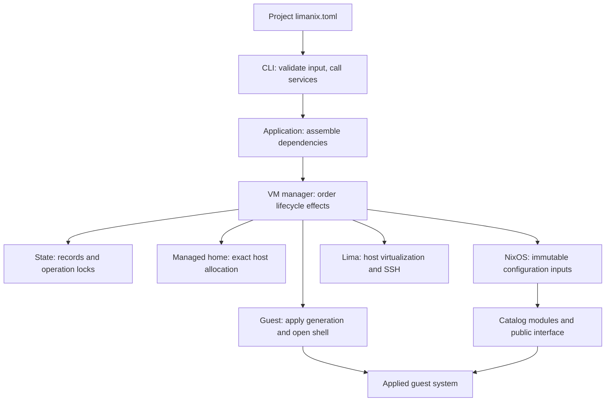

# Architecture

The client prepares and applies a VM configuration.
The catalog owns the selected guest software.
The documentation site combines their guides with shared pages.



## Responsibilities

| Component | Owns | Boundary |
|---|---|---|
| `internal/cli` | Flags, help, output, command exit status | Calls application services; guest commands keep literal arguments |
| `internal/app` | Construction of concrete services | Wires dependencies without putting lifecycle policy in commands |
| `internal/config` | TOML shape, defaults, validation and reference | Parses without host I/O; loading resolves host paths from the real configuration file |
| `internal/domain` | Validated identities, paths, sizes and lifecycle records | Types and rules shared by the services |
| `internal/vm` | Create, update, start, stop, delete and list | Depends on `Backend`, `Store`, `Homes` and `Guest` contracts |
| `internal/state` | VM records, generations, retained-home ownership and locks | Atomic file writes; immutable ownership is separate from operation progress |
| `internal/managedhome` | Allocation and removal of one recorded host home | Does not delete project mounts |
| `internal/modules` | Embedded catalog and copied third-party sources | Preserves the catalog tree and confines imported modules to their own tree |
| `internal/nixos` | Platform base, catalog extraction and generated flake | Uses the catalog Nixpkgs pin; supplies public declarations to every guest |
| `internal/lima` | Lima runtime, virtualization, management SSH and host agent | Calls embedded Lima libraries; guest account access is delegated to `internal/guest` |
| `internal/guest` | Environment delivery, NixOS rebuild, restart and user shell | Does not allocate homes or save VM records |
| Catalog | Tool packages, application settings, services and integrations | Public NixOS options and capability declarations |

The platform orders final system-profile inputs by store path and existing package priority; it preserves duplicate contributions, supported package forms and `mkForce` replacements.
Modules own explicit package priorities; the platform does not add collision rejection.

The contracts consumed by the VM manager live in `internal/vm/dependencies.go`.
The implementation package owns its concrete behavior; the consumer owns the narrow interface it needs.
The [development guide](development.md#source-layout) points to the source directories.

## Configuration delivery

```mermaid
sequenceDiagram
    participant Mac as Mac client
    participant Inputs as Generation inputs
    participant VM as Linux guest
    Mac->>Mac: Parse and validate TOML; check host requirements
    Mac->>Inputs: Copy selected modules and prepare pinned flake
    Mac->>VM: Start guest with read-only generation mount
    Mac->>VM: Install literal environment files
    VM->>VM: Build NixOS boot configuration
    Mac->>VM: Restart after successful rebuild
    Mac->>VM: Verify development-user command
    Mac->>Mac: Save ready record; prune old inputs
```

Creation also allocates a managed home and creates the backend VM.
Update preserves the saved identity and home, checks the disk size, and stops a running VM before editing its backend configuration.
Changing TOML alone has no effect until `create` or `update` applies it.

## Public guest contract

| Interface | Purpose |
|---|---|
| `config.limanix.user.name`, `.home` | Read the development account supplied by the client |
| `limanix.user.shell` | Select its login shell; Bash is the platform default |
| `limanix.session.command` | Optional absolute provider executable for named sessions |
| `limanix-session NAME` | Stable guest command invoked by `limanix shell --session NAME` |
| `limanix-help`, `limanix-info` | Local guest navigation and environment inspection available with any module selection |
| `lmx.capabilities.<area>.*` | Provider declarations shared by catalog and third-party modules |
| Documented `lmx.<module>.*` options | Settings owned by the selected module |
| Standard NixOS options | Packages, services, firewall rules and other system settings |

Public `catalog/_shared/*.nix` declarations load even with `modules = []`.
They declare capabilities without installing tools or enabling consumers.
Third-party modules use those options without importing catalog filesystem paths.
The old `runtime` and root-flake `inputs` arguments fail with migration guidance.
Generated files, directory layouts and flake internals are implementation details.
See the [catalog contract](https://limanix.dev/categories/nixos/catalog-contract.html) and [migration table](https://limanix.dev/categories/nixos/writing-modules.html#migrate-custom-modules).

## State and recovery

| State | Lives in | Recovery rule |
|---|---|---|
| VM identity and operation progress | Client state directory | Identity remains available when the progress record is damaged |
| Backend VM and guest disk | Lima backend storage | Delete removes the backend before client ownership records |
| Managed guest home | Configured `home.root` on the Mac | Preserved by default; removal requires `delete --remove-home` |
| Mounted project | Its original Mac directory | Shared file changes affect the original files |
| Applied system | Guest disk and Nix store | Rebuilt from the saved generation inputs |

VM operation locks serialize conflicting lifecycle changes.
Shell access does not take the exclusive lifecycle lock.
Lima power state and LimaNix operation progress are separate values in `list --json`.
A failed operation retains the records and inputs needed to diagnose work that may already have reached the backend.
An update can install environment files before a later rebuild fails; it is not a transaction that rolls back every guest effect.
Cancellation stops the managed guest rebuild unit and reports a failure when stopping cannot be confirmed.
Follow [Troubleshooting](troubleshooting.md) before removing state by hand.

## Validation boundaries

| Check | Establishes |
|---|---|
| Go unit and race tests | Parsing, records, ownership, orchestration, argument handling and concurrent access in tested scenarios |
| Generated-flake evaluation | The exact client/catalog pair composes on both guest architectures |
| Catalog result checks | Module settings, defaults, supported overrides and expected conflicts |
| Catalog smoke checks | Built commands, generated application configuration and declared integrations |
| Disposable VM run | Boot, applied services, mounted files and host-to-guest operations in that environment |

Evaluation does not build packages or boot a VM.
A command version check does not prove that its daemon or cloud account is usable.
Keep those checks separate when validating a change.
