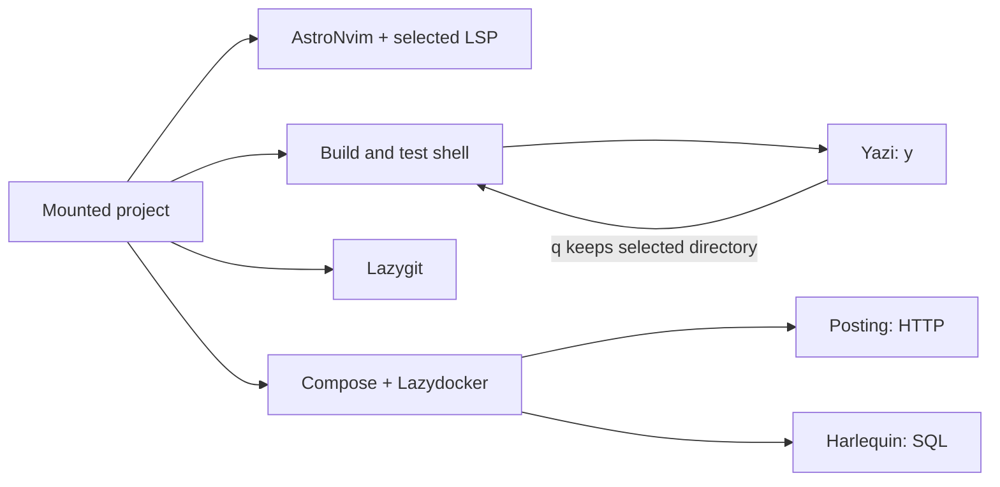

# Project workspace

Use one VM for your Linux tools, containers and project services.
LimaNix keeps the same platform conventions with any module selection; the Cozy module adds the development workbench.

## Choose the workspace size

| Selection | Guest behavior | Choose it for |
|---|---|---|
| `modules = []` | Platform account, mounts, SSH, Bash, local help, guest overview and shared public declarations | A small VM or your own modules |
| `lmx:console` | Configured shell, tmux, editor, file manager, Git tools and system inspection | Terminal development with your own toolchain choices |
| `lmx:docker` | Docker Engine, Compose and Lazydocker | Container projects |
| `lmx:cozy` | Console, Docker, common languages and LSP, local Kubernetes tools, cloud clients, HTTP and SQL clients | A complete common development workbench |

Cozy keeps its components independently selectable.
Rust, Terraform, Helm and a PostgreSQL server remain separate choices.
The [catalog](https://limanix.dev/categories/nixos/catalog.html) lists exact selectors and version lines.

## Shared VM conventions

Every guest supplies these commands, including with `modules = []`:

| Command | Result |
|---|---|
| `limanix-help` | VM identity, selected module selectors and guided guest/Mac commands |
| `limanix-info` | Identity, selected selectors, Linux kernel, shared mounts and failed system services |
| `limanix-session NAME` | Dispatch to the selected provider, or explain which optional provider to select |

The interactive development account receives a short welcome pointing to `limanix-help`.
The Bash fallback prompt shows the account, VM hostname and directory with Mocha accents when Starship is disabled.
`NO_COLOR` or `TERM=dumb` selects a plain prompt.
Optional shell and prompt modules keep their own configuration; the base does not require Console, tmux or Docker.
The module list reports original selected selectors, not every transitive component import.

## Create the workbench

Save [the Cozy example](examples/cozy.toml) as `limanix.toml` beside the project on your **Mac**.
It mounts that project at `/workspace` and selects `lmx:cozy`.
The example allocates 4 CPUs, 8 GiB memory and a 40 GiB guest disk; adjust them for your workload and available host resources.
On Intel, change `resources.arch` from `"arm64"` to `"amd64"`.

```console
limanix modules list
limanix create --config limanix.toml
limanix shell cozy-dev
```

The first command confirms that your installed build contains `lmx:cozy`.
Creation needs network access for the image and package dependencies; expect several GiB of initial downloads for Cozy.
The example's 8 GiB memory and 40 GiB disk are a starting point, not a limit on project requirements.
Leave extra guest-disk space for Docker images, volumes, Kubernetes clusters and build caches.
First-create time depends on downloads, available caches and build work.
If you already have a VM, change its module selection and use `limanix update --config limanix.toml` instead.
An update restarts the VM.

Inside the **VM**, open the mounted project:

```console
tmux-project /workspace
```

| Window | Starts | Use it for |
|---|---|---|
| `editor` | AstroNvim | Code, search, diagnostics and language servers |
| `shell` | Your guest login shell | Build and test commands |
| `git` | Lazygit | Review project changes |
| `containers` | Lazydocker | Container status and logs |

Use `Ctrl-b n` and `Ctrl-b p` to change windows.
Use `Ctrl-b d` to detach, then run `tmux-project /workspace` again to return.
The physical project directory identifies the session, including when two projects have the same basename.
Starting it again preserves the existing windows.
Editor, Git and container windows open a shell when the application exits, fails or cannot start.
Inside an existing tmux client, the command switches that client to the project session.
It does not initialize a Git repository or start project containers.

For an ordinary named session from the **Mac**:

```console
limanix shell cozy-dev --session work
```

This creates or attaches to `work` through the guest session provider.
It shares the tmux server with the project workspace.

## Move between tools



Run `y` in Bash or Zsh to browse project files.
Press `q` to return with the selected directory as your shell's working directory.
Press `Q` to keep the previous shell directory.
Running `yazi` directly does not change the parent shell's directory.

Go, Python and Node.js supply their language servers through the public language-support capability.
AstroNvim enables those declarations; optional Rust adds rust-analyzer through the same contract.
The editor's bundled plugins and parsers come from Nix rather than first-launch downloads.
Open the project at its guest path for language servers to see its Linux dependencies.

The shell, tmux, editor, Yazi, Lazygit, Posting and Harlequin use Catppuccin Mocha defaults.
Personal configuration takes precedence as described on each [module page](https://limanix.dev/categories/nixos/catalog.html).
Set a Nerd Font, truecolor and OSC 52 clipboard support in the terminal on your Mac.

## Work in your project

Run your project's build and test commands from the `shell` window.
The editor, Git interface and container view use the same mounted project directory.
Your project supplies its source, dependencies, service definitions and connection settings.

| Task | Tool | Project input |
|---|---|---|
| Build and test | Guest shell | Commands from your project's documentation |
| Run project services | Docker Compose | Your Compose configuration |
| Send HTTP requests | [Posting](https://limanix.dev/categories/nixos/modules/posting/README.html) | Your API endpoints and request collections |
| Inspect a database | [Harlequin](https://limanix.dev/categories/nixos/modules/harlequin/README.html) | Your database connection |

Keep project credentials out of version control.
Use the `containers` window to inspect your running services and their logs.

## Add infrastructure tools deliberately

| Tool | Starts work when you run | Persistent state |
|---|---|---|
| Docker | `docker compose up` or `docker run` | Guest disk: images, containers and volumes |
| Minikube | `minikube start --driver=docker --profile=dev` | Cluster profile and Docker state |
| AWS CLI | An authenticated AWS command | Personal AWS configuration and credentials |
| Google Cloud CLI | An authenticated Google Cloud command | Personal gcloud configuration |

Selecting Cozy installs these tools and enables Docker Engine.
It does not create a Kubernetes cluster, authenticate cloud accounts or provision cloud resources.
Check the selected account, project, region and Kubernetes context before running project commands.
The individual [Docker](https://limanix.dev/categories/nixos/modules/docker/README.html), [Minikube](https://limanix.dev/categories/nixos/modules/minikube/README.html) and [cloud tools](https://limanix.dev/categories/nixos/modules/cloud-tools/README.html) pages define their setup and corner cases.

## Keep work across updates

| Work | Before stopping or updating |
|---|---|
| Unsaved editor buffers | Save files |
| Tmux layout | Press `Ctrl-b Ctrl-s` and wait for the snapshot |
| Build or test processes | Finish or stop them |
| Project services | Record how to restart them |

The guest home and project mounts preserve their files across an update.
Tmux can restore a saved layout after restart; it does not resume processes or unsaved buffers.
Deleting a VM removes its guest disk, including Docker volumes, while the managed home is preserved by default.
Read [Storage and data](virtual-machines.md#storage-and-data) before deleting an environment.
